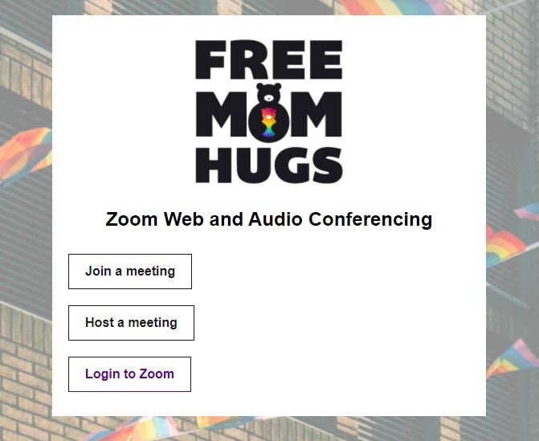
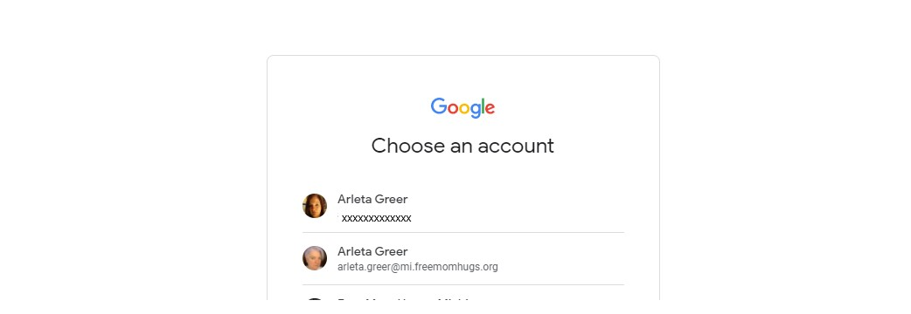

# Login to Zoom on the Web

## Logging in from the Web

To login to Zoom using a web browser, visit [https://freemomhugs.zoom.us](https://freemomhugs.zoom.us) in your web browser and select "Login to Zoom"

From here, you can click on 'Login to Zoom button to log into your account. 

The screen will refresh to show the home page for zoom.  From this page, you can view upcoming or previous meetings you have created, as well as information about your personal room and various other functions. 

